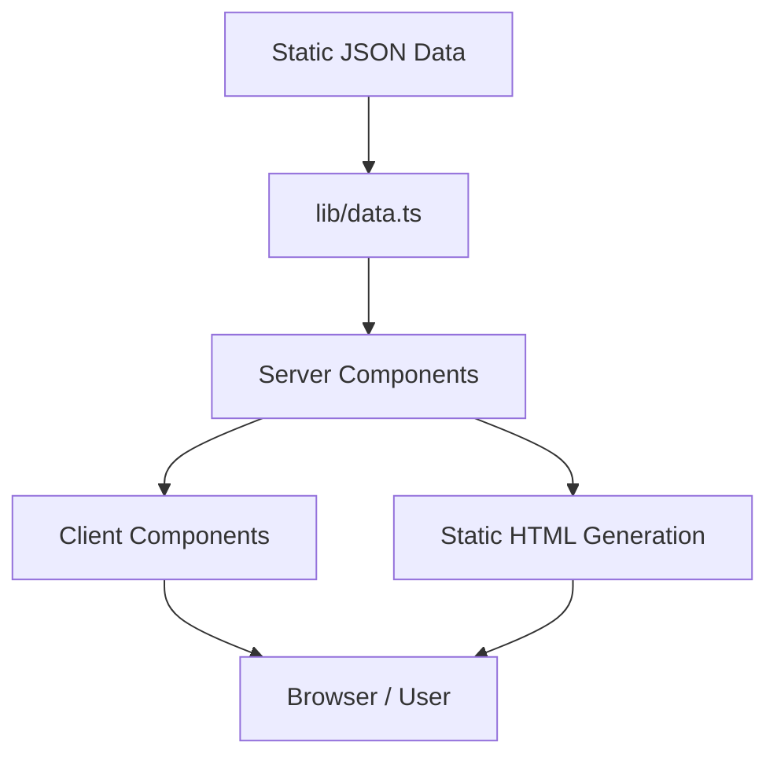

# Architecture Specification

## Project Overview
Beautiful Bangladesh is a tourism platform built using Next.js 15+ (App Router). The tech stack includes:
- **Next.js 15+ (App Router)**: Core framework for routing, rendering, and API.
- **TypeScript (Strict Mode)**: For type safety and better developer experience.
- **Tailwind CSS v4**: CSS-first config for styling, implementing the "Bengal Monsoon" design system.
- **Framer Motion + GSAP**: For sophisticated animations and interactions.
- **Data Source**: Static JSON files.
- **Assets**: Unsplash images with proper attribution.

## Design System: Bengal Monsoon
- **Colors**:
  - Sundarbans: `#0B6E4F`
  - Paddy Gold: `#D4A843`
  - Cox's Azure: `#1B6B93`
  - Terracotta: `#C2704E`
  - Monsoon Slate: `#1E293B`
  - River Mist: `#F0F4F8`
- **Typography**:
  - Display: Playfair Display
  - Body: Inter
  - Accent: Noto Sans Bengali
- **Signature Elements**: River-flow scroll progress indicator.

## Application Architecture



## Data Flow
- **JSON files**: All static content (destinations, categories, etc.) resides in JSON files.
- **`lib/data.ts`**: Centralized service for reading and parsing JSON files.
- **Server Components**: Fetch data from `lib/data.ts` during build time/request time.
- **Client Components**: Receive necessary data as props from Server Components; handle interactive state.

## Rendering Strategy
- **Static Site Generation (SSG)**: Primary rendering strategy.
- We use `generateStaticParams` for all dynamic routes:
  - Destination pages (`/destinations/[slug]`)
  - Category pages (`/categories/[category]`)
  - Division pages (`/divisions/[division]`)
  - Guide pages (`/guides/[slug]`)

## Component Architecture: Server vs Client Decision Tree
- **Default**: Server Components.
- **When to use Client Components (`'use client'`)**:
  - Requires React hooks (`useState`, `useEffect`, `useReducer`).
  - Requires custom event listeners.
  - Requires browser APIs (e.g., `window`, `localStorage`).
  - Requires Framer Motion or GSAP animations triggered by user interaction.

## Image Optimization
- Use `next/image` (`<Image />`) for all images.
- **Configuration**: Set `remotePatterns` in `next.config.js` to allow `images.unsplash.com`.
- **Optimization**: Provide appropriate `sizes` attributes for responsive `srcset` generation.
- **Placeholders**: Use `placeholder="blur"` and pre-generated `blurDataURL` for above-the-fold images to improve LCP and UX.

## Route Structure
- `/`: Homepage
- `/destinations`: List of all destinations
- `/destinations/[slug]`: Destination details
- `/categories/[category]`: Filter by category (e.g., beaches, heritage)
- `/divisions/[division]`: Filter by division
- `/search`: Search interface
- `/guides`: Travel guides
- `/guides/[slug]`: Specific guide
- `/about`: About page

## State Management
- **URL State**: Use query parameters for search, filters, and pagination (`useSearchParams`, `useRouter`, `usePathname`).
- **React State**: Use `useState` or `useReducer` for localized UI interactions (e.g., modals, accordions).
- **No Global State Library**: We rely on Server Components passing data down and URL state, avoiding Redux/Zustand.

## Performance Strategy
- **RSC by Default**: Send zero JavaScript to the client whenever possible.
- **Code Splitting**: Utilize dynamic imports (`next/dynamic`) for heavy client components (e.g., interactive maps, complex charts) that aren't needed immediately.
- **Preloading**: Preload critical fonts and hero images.

## Error Handling
- Use `error.tsx` for handling runtime errors gracefully at specific route segments.
- Use `not-found.tsx` to handle 404s when data lookups fail (e.g., in `generateStaticParams` or data fetches).

## Directory Structure
```
/
├── app/                  # Next.js App Router (pages, layouts, error, not-found)
├── components/           # Reusable UI components
│   ├── server/           # Server Components only
│   ├── client/           # Client Components only ('use client')
│   └── ui/               # Generic UI elements (buttons, cards)
├── data/                 # Static JSON data files
├── lib/                  # Utilities, data fetching functions (lib/data.ts), types
├── public/               # Static assets (fonts, icons)
├── specs/                # Project specifications (this file)
├── styles/               # Global CSS, Tailwind configurations
├── types/                # Global TypeScript definitions
├── next.config.js        # Next.js configuration
├── tailwind.config.ts    # Tailwind CSS configuration
└── tsconfig.json         # TypeScript configuration
```
